# CATATIN — Detailed Product Flowcharts v3.2
## PC & Mobile Navigation + Screen Flows

**Basis:** Catatin Master PRD v3

**Changelog v3.2:** menambahkan Approval Inbox (Persetujuan) §25, Notification Center §26, aturan cutoff statement kartu kredit, settlement traceability, tracking periode tagihan bulanan, dan pembaruan navigasi/route/E2E terkait.

Dokumen ini memetakan alur navigasi dan interaksi utama Catatin untuk desktop/PC dan mobile. Diagram dibuat untuk menjadi referensi UX/UI, frontend implementation, API wiring, dan E2E testing.

---

## 0. Prinsip Navigasi Global

### Desktop / PC

```text
┌──────────────────────────────────────────────────────────────────────┐
│ CATATIN             TOP AREA: Group/Profile + Filter + Notifications │
├───────────────┬──────────────────────────────────────────────────────┤
│ LEFT SIDEBAR  │ MAIN CONTENT                                         │
│               │                                                      │
│ Dashboard     │ Current Screen                                       │
│ Transaksi     │                                                      │
│ + Tambah      │                                                      │
│ Tagihan       │                                                      │
│ Wallet        │                                                      │
│ Budget        │                                                      │
│ Laporan       │                                                      │
│               │                                                      │
│ Profile       │                                                      │
│ Settings      │                                                      │
└───────────────┴──────────────────────────────────────────────────────┘
```

### Mobile

```text
┌───────────────────────────────┐
│ Header: Screen + Group/Profile│
├───────────────────────────────┤
│                               │
│        MAIN CONTENT           │
│                               │
│                               │
├───────────────────────────────┤
│ Dashboard │ Transaksi │ + │   │
│ Tagihan   │ More/Profile      │
└───────────────────────────────┘
```

### Global App Entry Flow

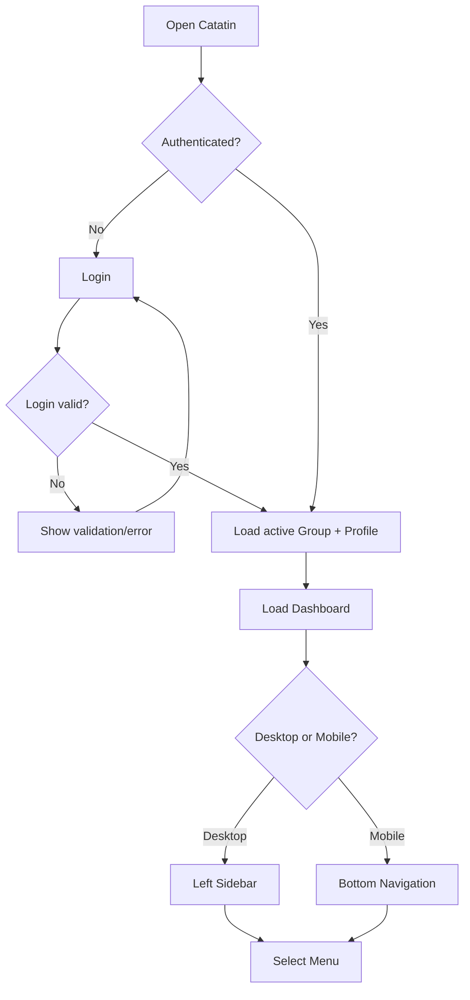

---

# 1. Dashboard

## 1.1 Tujuan

Dashboard adalah pusat navigasi dan ringkasan cashflow. Default periode adalah **Bulan Ini** dan context profile adalah **Semua Anggota**.

## 1.2 Struktur PC

```text
┌────────────────────────────────────────────────────────────┐
│ Keluarga Dinar ▼     Profile: Semua Anggota ▼   [Filter] │
├────────────────────────────────────────────────────────────┤
│ Greeting                                                   │
│ Total Saldo                                                │
│ ┌────────────┐ ┌────────────┐ ┌────────────┐             │
│ │ Income     │ │ Expense    │ │ Net Cashflow│            │
│ └────────────┘ └────────────┘ └────────────┘             │
│                                                            │
│ ┌────────────────────┐ ┌───────────────────────────────┐  │
│ │ Spending Utama     │ │ Upcoming Bills / Cicilan      │  │
│ └────────────────────┘ └───────────────────────────────┘  │
│                                                            │
│ ┌────────────────────┐ ┌───────────────────────────────┐  │
│ │ AI Insight         │ │ Budget Status                  │  │
│ └────────────────────┘ └───────────────────────────────┘  │
│ Pending Persetujuan: 2 draft → [Buka Approval Inbox]     │
│ Recent Transactions                                      │
└────────────────────────────────────────────────────────────┘
```

## 1.3 Struktur Mobile

```text
┌───────────────────────────────┐
│ Keluarga Dinar ▼              │
│ Semua Anggota ▼    [Filter]   │
├───────────────────────────────┤
│ Greeting                      │
│ Total Saldo                   │
│ Income / Expense              │
│ Spending Utama                │
│ Bills / Cicilan / Hutang      │
│ AI Insight                    │
│ Budget                        │
│ Persetujuan (jika ada draft)  │
│ Recent Transactions           │
├───────────────────────────────┤
│ Home │ Trans │ + │ Bills │ More│
└───────────────────────────────┘
```

## 1.4 Flow Dashboard

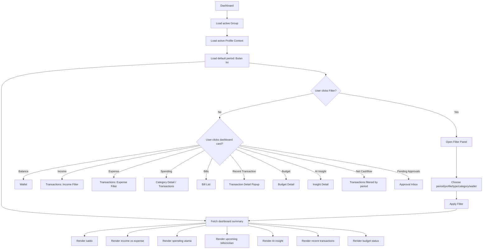

### Responsive rule

- PC: sidebar tetap terlihat.
- Mobile: bottom navigation tetap terlihat.
- Semua card dengan target detail harus clickable.
- Filter panel menjadi drawer/popover di PC dan bottom-sheet/full-height di mobile.

---

# 2. Group / Profile Selector

## 2.1 Tujuan

Satu dashboard dapat dipakai beberapa orang dalam satu group/family.

Context pilihan:
- Semua Anggota
- Profile Dinar
- Profile Istri
- Profile lain yang aktif

## 2.2 Flow

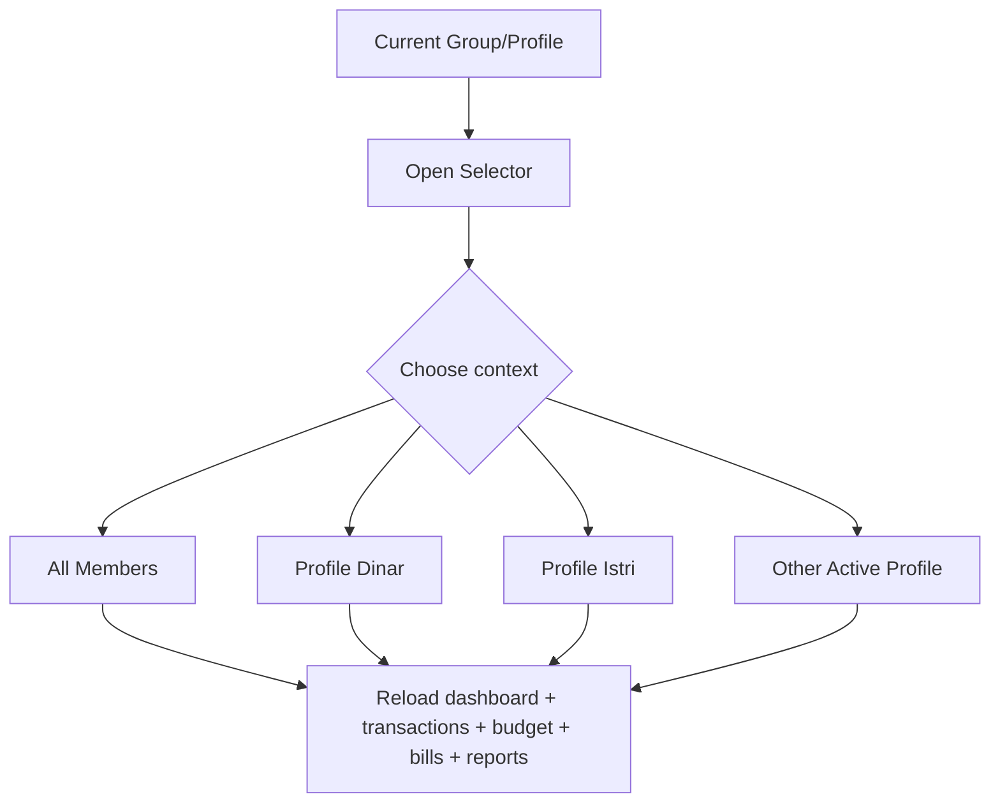

### PC

Selector ada di top bar/sidebar header.

### Mobile

Selector ada di header atau bottom-sheet selector.

---

# 3. Transactions

## 3.1 PC Layout

```text
┌─────────────────────────────────────────────────────────────┐
│ Transaksi                         [Search] [Filter] [+ Add] │
├─────────────────────────────────────────────────────────────┤
│ Date │ Merchant │ Category │ Profile │ Wallet │ Amount    │
│-------------------------------------------------------------│
│ 17/8 │ Superindo│ Food     │ Dinar   │ BCA    │ Rp350.000 │
│ 17/8 │ Salary   │ Salary   │ Istri   │ BCA    │ Rp8.000k  │
└─────────────────────────────────────────────────────────────┘
```

## 3.2 Mobile Layout

```text
┌───────────────────────────────┐
│ Transaksi       [Search][⚙]  │
├───────────────────────────────┤
│ 17 Agu                        │
│ Superindo              +350K │
│ Food · Dinar                  │
│                               │
│ Salary                 +8 jt  │
│ Income · Istri                │
│                               │
│ [ + Tambah Transaksi ]        │
└───────────────────────────────┘
```

## 3.3 Flow

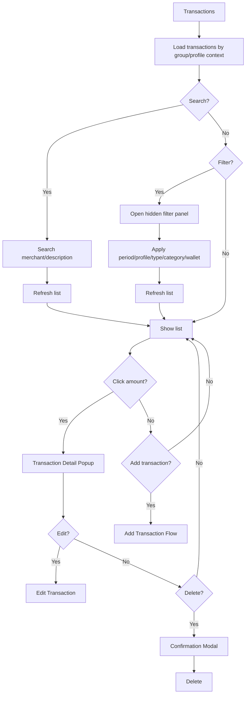

---

# 4. Add Transaction

Ini adalah salah satu flow inti Catatin.

## 4.1 Entry Options

```text
Tambah Transaksi
├── Scan Struk
└── Input Manual
```

## 4.2 Manual Flow

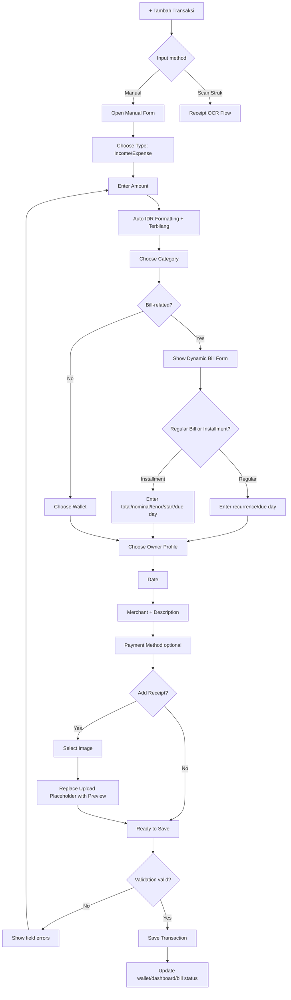

## 4.3 Mobile-specific add flow

Tambahkan action sheet dari tombol `+`:

```text
       [+]
        │
        ▼
┌─────────────────────┐
│ Tambah Transaksi    │
├─────────────────────┤
│ 📷 Scan Struk       │
│ ✍ Input Manual      │
│ ✕ Batal              │
└─────────────────────┘
```

PC dapat menggunakan split action/menu langsung di sidebar atau button.

---

# 5. Scan Receipt / OCR

## 5.1 PC

```text
┌─────────────────────────────────────────────────────────────┐
│ Scan Struk                                                  │
├───────────────────────────┬─────────────────────────────────┤
│ Receipt Preview            │ Extracted Fields                │
│                           │ Merchant                         │
│       [IMAGE]             │ Date                             │
│                           │ Total                            │
│                           │ Category                         │
│                           │ Wallet                           │
│                           │ Items                            │
│                           │                                  │
│                           │ [Review & Approve]               │
└───────────────────────────┴─────────────────────────────────┘
```

## 5.2 Mobile

```text
┌───────────────────────────────┐
│ Scan Struk                    │
├───────────────────────────────┤
│           [IMAGE]             │
│                               │
├───────────────────────────────┤
│ Merchant                      │
│ Date                          │
│ Total                         │
│ Category                      │
│ Wallet                        │
│ Items                         │
│                               │
│ [Review & Approve]            │
└───────────────────────────────┘
```

## 5.3 OCR/AI Flow

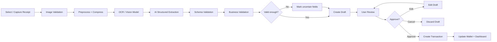

### Important

- OCR/AI output dianggap **untrusted input** sebelum schema + business validation.
- Tidak perlu menampilkan angka confidence kepada user.
- Field yang meragukan diberi indikator sederhana.
- 1 receipt = 1 transaksi.
- Draft hasil review yang disimpan (misal user menutup alur) masuk **Approval Inbox (§25)** dan dapat dilanjutkan kapan saja.

---

# 6. Transaction Detail Popup

## Flow

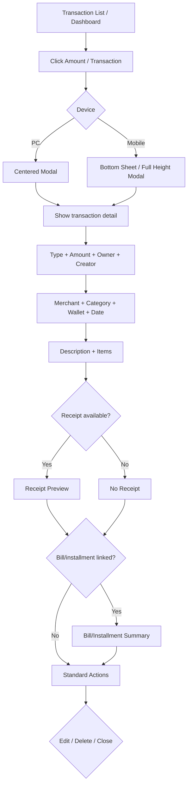

---

# 7. Tagihan — Unified Billing Hub

## 7.1 Main Tagihan Screen

Tagihan adalah satu-satunya menu utama untuk seluruh kewajiban pembayaran. Tidak ada menu Hutang terpisah.

### PC

```text
┌───────────────────────────────────────────────────────────────┐
│ Tagihan                                      [Filter] [+]      │
├───────────────────────────────────────────────────────────────┤
│ [Semua] [Tagihan Biasa] [Tagihan Bulanan] [Hutang/Cicilan]  │
│ [Kartu Kredit]                                                │
├───────────────────────────────────────────────────────────────┤
│ Summary: Belum Dibayar | Jatuh Tempo | Overdue | Lunas      │
│                                                               │
│ Netflix              Rp186.000     Bulanan     Due 15        │
│ Cicilan Motor        Rp500.000     Hutang      Due 25        │
│ Hutang Budi           Rp300.000     Hutang      Due 20        │
│ Kartu Kredit BCA    Rp1.000.000     Statement   Due 25       │
└───────────────────────────────────────────────────────────────┘
```

### Mobile

```text
┌───────────────────────────────┐
│ Tagihan              [Filter] │
├───────────────────────────────┤
│ [Semua] [Biasa] [Bulanan]    │
│ [Hutang/Cicilan] [Kartu]     │
├───────────────────────────────┤
│ Netflix                        │
│ Rp186.000 • Bulanan           │
│ Due 15                         │
│                                │
│ Cicilan Motor                  │
│ Rp500.000 • 7/24               │
│ Due 25                         │
│                                │
│ Kartu Kredit BCA               │
│ Rp1.000.000 • Statement        │
│ Due 25                         │
└───────────────────────────────┘
```

## 7.2 Main Flow

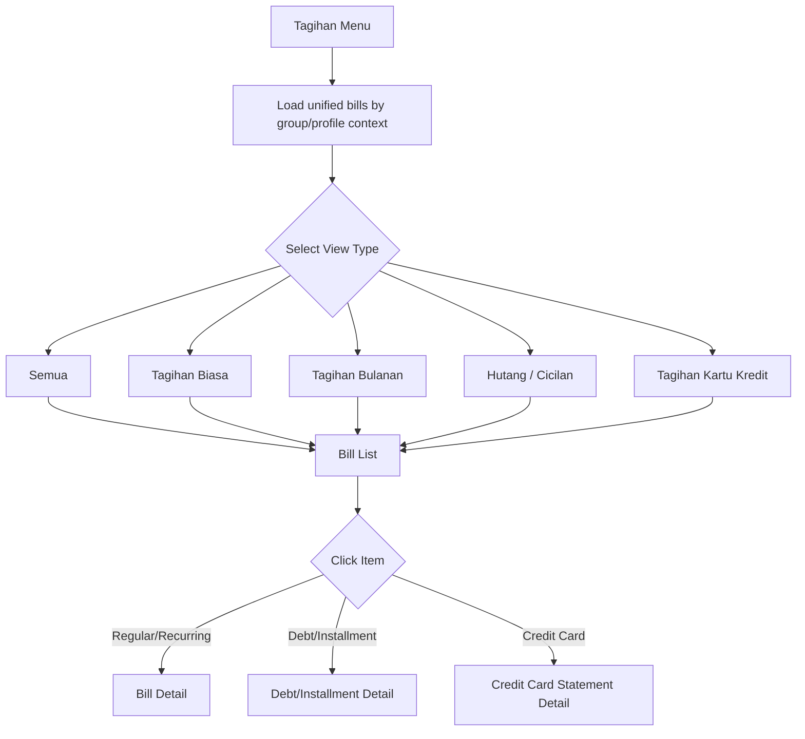

## 7.3 Regular / Recurring Bill

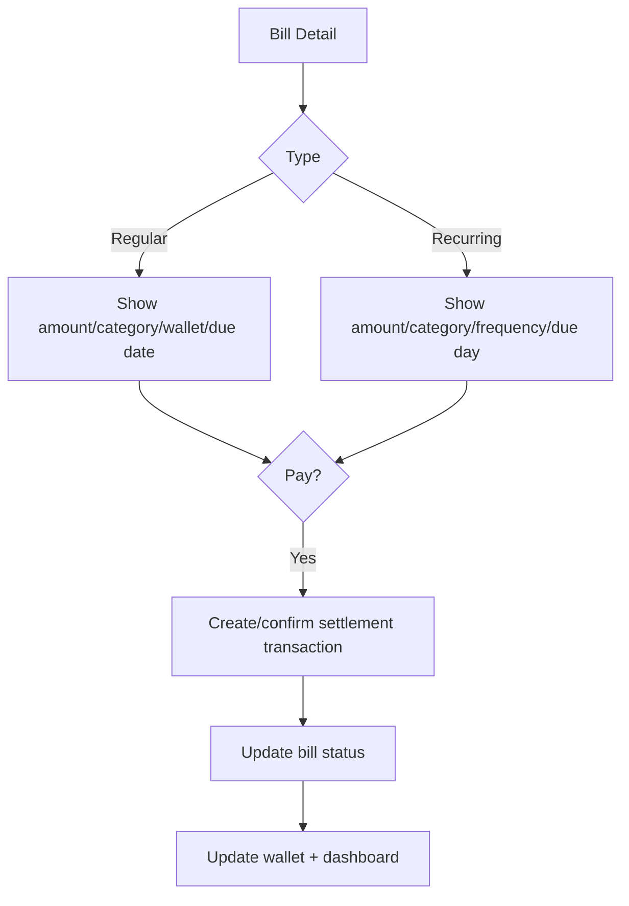

Recurring bill menyimpan `last_paid_period` (YYYY-MM). "Bayar bulan ini" membuat transaksi expense untuk periode tersebut dan memperbarui last_paid_period; sistem mencegah pembayaran ganda untuk periode yang sama. Status jatuh tempo dihitung saat dibaca (derived), bukan disimpan.

## 7.4 Debt / Installment

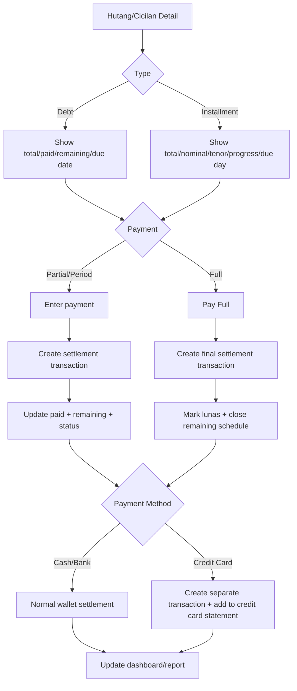

Catatan: status (belum_dibayar/overdue/lunas) dan progress cicilan dihitung derived dari paid/remaining vs total dan due date, bukan disimpan.

## 7.5 Credit Card Aggregation Flow

Transaksi pembelian/hutang/cicilan menggunakan kartu kredit tetap terpisah agar histori transaksi tetap akurat. Sistem kemudian mengakumulasikannya pada statement kartu kredit.

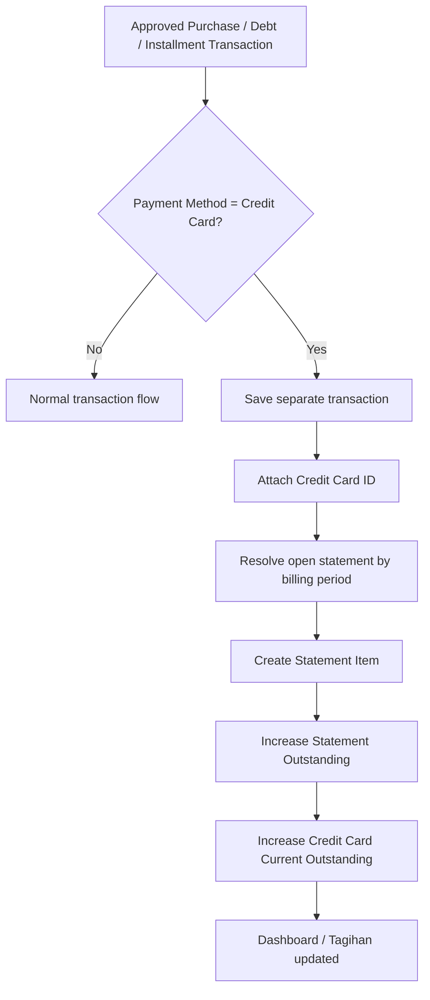

**Aturan cutoff statement:** transaksi masuk statement berdasarkan `occurred_at` (tanggal transaksi). Transaksi dengan tanggal ≤ period_end statement yang sedang open (open/issued) masuk statement tersebut; transaksi setelah period_end masuk statement periode berikutnya (dibuat on-demand).

Example:

```text
Kartu Kredit BCA

Transaction A  Cicilan Motor      Rp500.000
Transaction B  Hutang Budi         Rp300.000
Transaction C  Belanja             Rp200.000
────────────────────────────────────────
Statement Outstanding             Rp1.000.000
```

Klik **Kartu Kredit BCA** di Tagihan → buka **Credit Card Statement Detail**.

## 7.6 Credit Card Statement Detail

### PC

```text
┌─────────────────────────────────────────────────────────────┐
│ Tagihan Kartu Kredit BCA                         [Bayar]     │
├─────────────────────────────────────────────────────────────┤
│ Outstanding       Rp1.000.000                               │
│ Sudah Dibayar     Rp0                                        │
│ Sisa Tagihan      Rp1.000.000                               │
│ Jatuh Tempo       25/08/2026                                │
├─────────────────────────────────────────────────────────────┤
│ Transaksi Penyusun                                             │
│ Cicilan Motor        Rp500.000    → Detail Cicilan           │
│ Hutang Budi          Rp300.000    → Detail Hutang            │
│ Belanja              Rp200.000    → Detail Transaksi         │
└─────────────────────────────────────────────────────────────┘
```

### Mobile

```text
Tagihan Kartu Kredit BCA
──────────────────────────
Outstanding       Rp1.000.000
Sudah Dibayar      Rp0
Sisa              Rp1.000.000
Due               25/08/2026

Transaksi
• Cicilan Motor      500.000 >
• Hutang Budi        300.000 >
• Belanja            200.000 >

[ Bayar Tagihan ]
```

Setiap item dapat diklik untuk membuka detail data asalnya.

## 7.7 Payment of Credit Card Statement

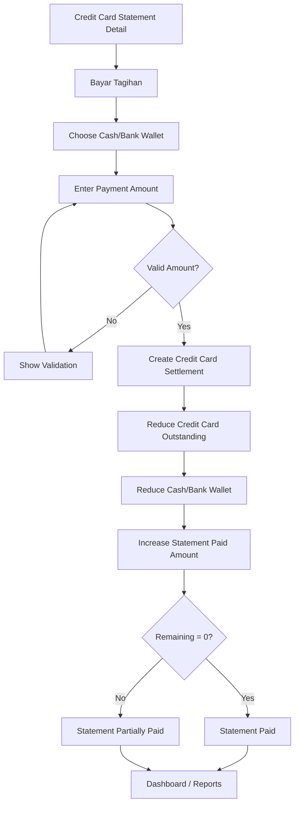

**Important:** Credit card statement payment is a liability settlement and must **not** create a second expense classification. Expense already exists on the original purchase/debt/installment transaction.

**Traceability:** setiap pembayaran statement dicatat sebagai transaksi `type: credit_card_settlement` pada wallet kas yang dipilih:
- muncul di riwayat wallet (label UI "Bayar Tagihan Kartu Kredit BCA") agar saldo selalu traceable;
- tidak dihitung sebagai expense/income pada agregasi periode;
- mendukung pembayaran parsial; sisa tagihan tetap tampil sampai lunas.

## 7.8 Reminder Flow

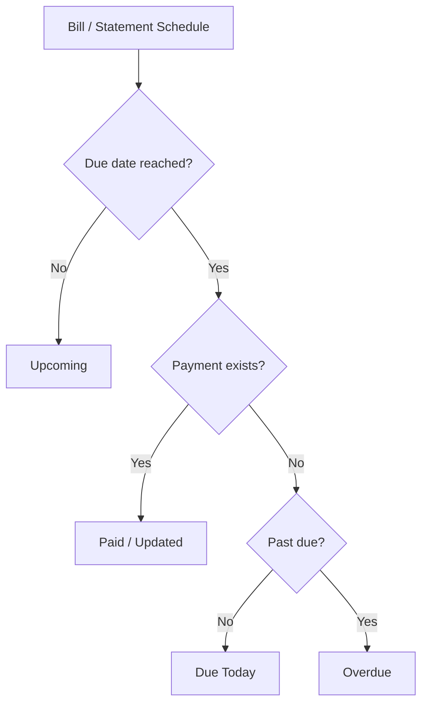

No transaction is created only because a reminder is due.


# 8. Wallet

## PC

```text
┌──────────────────────────────────────────────────────────┐
│ Wallet                             [+ Add Wallet]         │
├──────────────────────────────────────────────────────────┤
│ BCA Dinar            Rp4.500.000                         │
│ BCA Istri             Rp3.000.000                        │
│ Rekening Keluarga     Rp8.000.000                        │
├──────────────────────────────────────────────────────────┤
│ Wallet Detail                                          → │
└──────────────────────────────────────────────────────────┘
```

## Mobile

```text
Wallet
──────────────
BCA Dinar       4,5 jt
BCA Istri       3 jt
Keluarga        8 jt

[+ Tambah Wallet]
```

## Flow

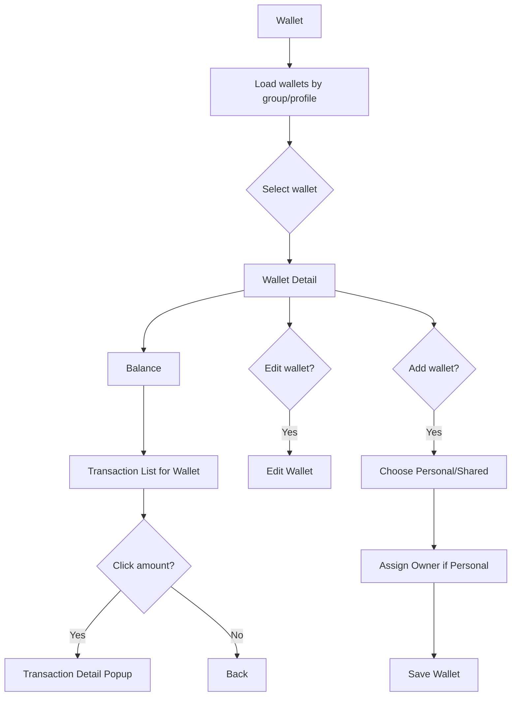

### Balance rule

Saldo wallet berubah berdasarkan transaksi cashflow yang approved/saved, bukan sekadar reminder.

Opening balance dicatat sebagai transaksi `source: opening_balance` (label UI "Saldo Awal"); muncul di riwayat wallet namun tidak dihitung sebagai income periode.

---

# 9. Budget

## Flow

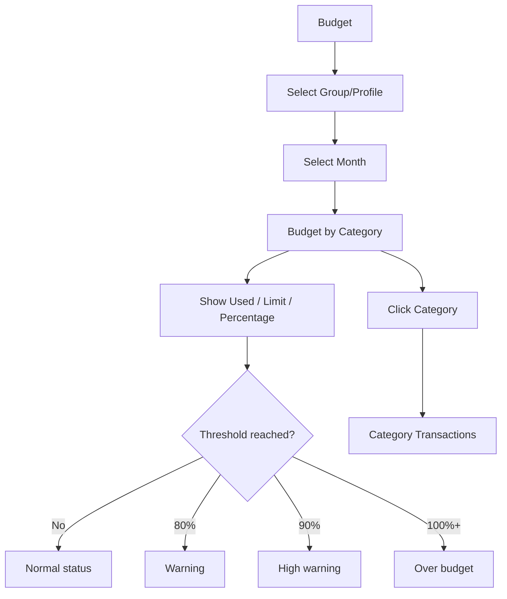

Budget dapat:
- personal profile, atau
- shared group.

---

# 10. Debt / Receivable — Accessed Through Tagihan

Tidak ada menu Hutang/Piutang terpisah pada navigation. Semua debt/receivable diakses melalui:

**Tagihan → Hutang/Cicilan**

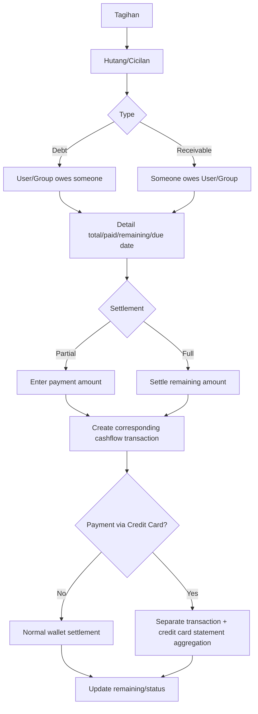

Klik transaksi settlement membuka popup transaction detail seperti transaksi biasa.

# 11. Reports

## PC

```text
┌─────────────────────────────────────────────────────────────┐
│ Reports                              [Filter] [PDF] [Excel] │
├─────────────────────────────────────────────────────────────┤
│ Period: Bulan Ini   Profile: Semua                        │
│                                                             │
│ Income │ Expense │ Net Cashflow                            │
│                                                             │
│ Spending by Category        Spending by Wallet             │
│ Merchant Detail             Transaction Detail             │
│ Budget Comparison            Bills / Installments         │
│ Debt / Receivable             AI Insight                  │
└─────────────────────────────────────────────────────────────┘
```

## Mobile

Gunakan cards berurutan dengan filter sebagai bottom sheet. Export buttons tetap tersedia di bagian action/overflow.

## Flow

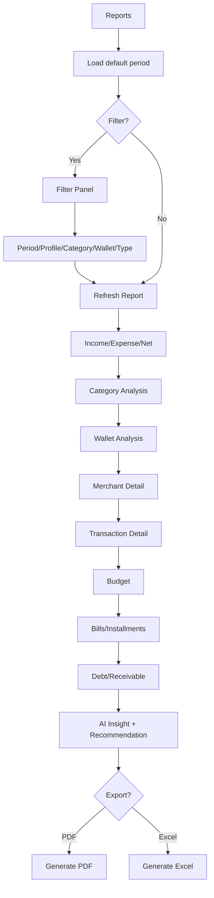

---

# 12. Profile / Family / Group

## 12.1 PC

```text
Profile
├── My Profile
├── Family / Group
│   ├── Group Name
│   └── Members
├── Invite Member
└── Preferences
```

## 12.2 Mobile

```text
More
├── Profile Saya
├── Keluarga / Group
├── Anggota
├── Invite Member
├── Settings
└── Logout
```

## 12.3 Flow

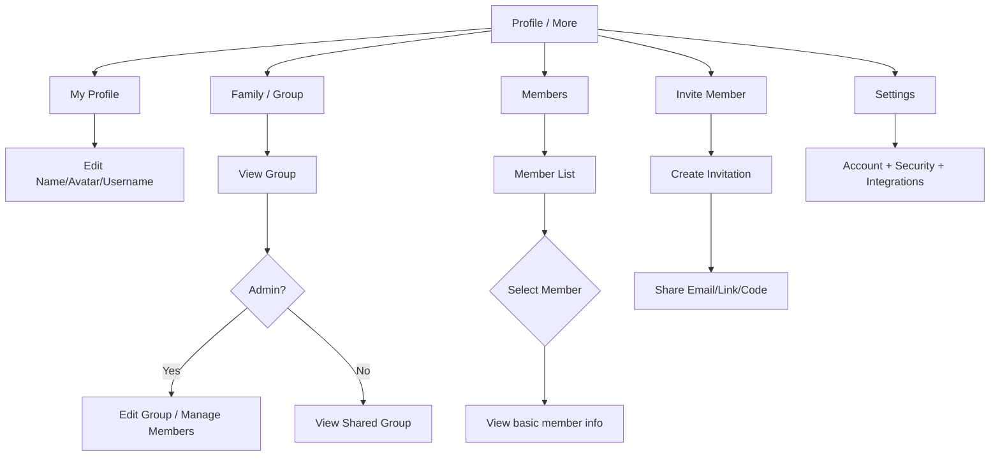

---

# 13. Settings & Integrations

Menu Settings berisi area administratif tanpa menjadi permission matrix kompleks.

```text
Settings
├── Account & Security
├── Category
├── Wallet Settings
├── Group Settings (Admin)
├── API Access / Hermes
├── Telegram
├── WhatsApp
├── AI/OCR Configuration (Admin / system-level)
└── Logout
```

## Hermes / API Flow

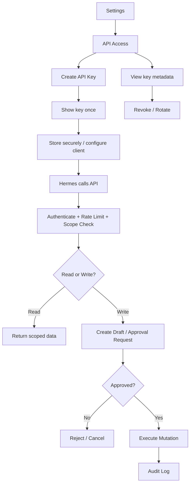

Approval dilakukan user melalui **Approval Inbox (Persetujuan)**; draft tidak dapat disetujui dari luar aplikasi. Alur lengkap lihat §25.

## Telegram / WhatsApp Flow

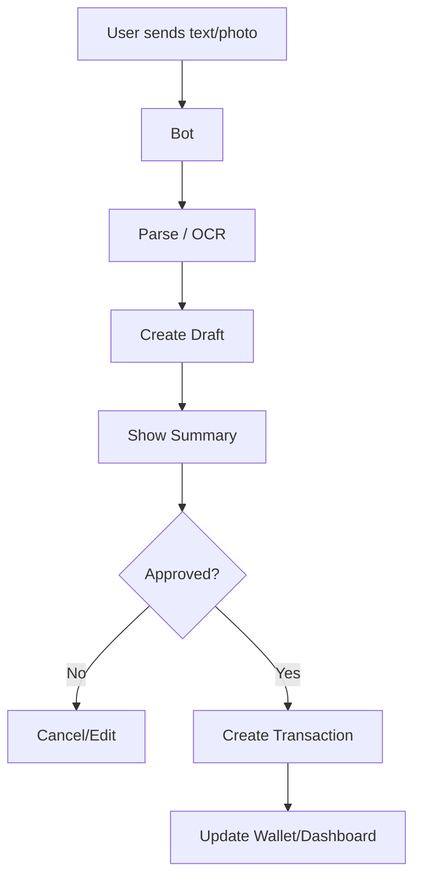

---

# 14. Global Filter Flow

Filter harus **hidden by default** di dashboard dan list.

```mermaid
flowchart TD
    A[Dashboard / Transactions / Reports] --> B[Filter Button]
    B --> C{Desktop or Mobile?}
    C -- Desktop --> D[Popover / Drawer]
    C -- Mobile --> E[Bottom Sheet / Full Height]
    D --> F[Period]
    E --> F
    F --> G{Preset}
    G --> H[Hari Ini]
    G --> I[7 Hari Terakhir]
    G --> J[Bulan Ini]
    G --> K[Tanggal Spesifik]
    K --> L[Start Date + End Date]
    H --> M[Profile]
    I --> M
    J --> M
    L --> M
    M --> N[Income/Expense]
    N --> O[Category]
    O --> P[Wallet]
    P --> Q[Apply]
    Q --> R[Reload current screen]
```

Setelah ditutup, filter aktif ditampilkan ringkas:

`Bulan ini · Dinar · Expense`

---

# 15. Global Number / Nominal Flow

```mermaid
flowchart LR
    A[User types digits] --> B[Parse numeric value]
    B --> C[Format IDR in UI]
    C --> D[Generate Terbilang]
    D --> E[Display]
    B --> F[Store numeric value]
```

Contoh:

```text
Input: 1250000
UI:    Rp1.250.000
Text:  Satu juta dua ratus lima puluh ribu rupiah
DB:    1250000
```

Berlaku minimal untuk:
- Transaction
- Budget
- Bill
- Installment
- Debt
- Receivable
- Wallet opening balance, jika tersedia

---

# 16. UI Copy / Proofreading Flow

Sebelum screen/phase dinyatakan selesai:

```mermaid
flowchart LR
    A[UI Completed] --> B[Check spelling]
    B --> C[Check terminology]
    C --> D[Check capitalization]
    D --> E[Check button labels]
    E --> F[Check empty/loading/error/success states]
    F --> G[Check Indonesian naturalness]
    G --> H[Approve UI Copy]
```

Terminologi yang harus konsisten:
- Pemasukan / Pengeluaran
- Tagihan / Cicilan
- Anggota / Profile
- Group / Keluarga
- Wallet / Dompet, pilih satu istilah UI dan konsisten
- Simpan / Batal / Hapus / Edit

---

# 17. End-to-End Core User Journey

Ini adalah flow paling penting untuk testing.

```mermaid
flowchart TD
    A[Login] --> B[Select Group/Profile Context]
    B --> C[Dashboard]
    C --> D{User Goal}

    D -- Catat transaksi --> E[+ Tambah]
    E --> F{Manual or Receipt}
    F -- Manual --> G[Fill Transaction]
    F -- Receipt --> H[OCR + AI]
    G --> I{Bill-related?}
    H --> J[Review Extraction]
    J --> K[Approve]
    K --> I
    I -- Yes --> L[Dynamic Bill Form]
    I -- No --> M[Save Transaction]
    L --> M

    D -- Setujui draft --> AP[Approval Inbox]
    AP --> M

    D -- Cek tagihan --> N[Tagihan]
    N --> O[Bill Detail]
    O --> P[Pay / Mark Period / Pay Full]
    P --> M

    D -- Analisa --> Q[Reports]
    Q --> R[Filter]
    R --> S[Read Analysis]

    D -- Kelola keluarga --> T[Profile / Group]
    T --> U[Member / Invite / Group]

    D -- Lihat saldo --> V[Wallet]
    V --> W[Wallet Detail]

    M --> X[Update Wallet]
    X --> Y[Update Dashboard]
    Y --> C
```

---

# 18. PC vs Mobile Interaction Matrix

| Area | PC / Desktop | Mobile |
|---|---|---|
| Navigation | Left sidebar | Bottom navigation |
| Dashboard | Multi-column cards | Stacked cards |
| Group/Profile | Top selector | Header selector / sheet |
| Filter | Popover/drawer | Bottom sheet/full-height |
| Transaction detail | Centered modal | Bottom sheet/full-height |
| Add Transaction | Sidebar/button | `+` action |
| Scan Receipt | Split view image + form | Image top + form below |
| Bill list | Table/list | Cards/list |
| Wallet | Cards/table | Stacked cards |
| Reports | Multi-column | Stacked sections |
| Profile | Sidebar content | More/Profile screen |
| Export | Inline actions | Overflow/action area |
| Touch target | Mouse/keyboard friendly | Minimum 44px |

---

# 19. Navigation State Rules

1. Active group/profile context harus dipertahankan ketika user berpindah menu, selama session aktif.
2. Filter yang diterapkan pada dashboard tidak wajib mengubah filter global seluruh aplikasi; setiap screen mempertahankan filter state-nya sendiri kecuali UX disepakati berbeda.
3. Klik summary dashboard harus membuka tujuan detail dengan context yang relevan.
4. Jika dashboard sedang menampilkan profile tertentu, transaksi/report/budget/bill yang dibuka dari card harus membawa context profile tersebut jika relevan.
5. Modal/bottom-sheet harus dapat ditutup tanpa kehilangan context layar utama.
6. Browser back pada desktop harus mengikuti routing screen; modal tetap dapat memiliki close/back behavior yang jelas.
7. Mobile bottom navigation tidak boleh menutupi content.
8. Tidak ada horizontal overflow akibat receipt preview, cards, table, atau modal.
9. Draft approval membawa konteks group/profile asal draft; membuka draft dari notifikasi atau dashboard tetap mempertahankan konteks tersebut.

---

# 20. E2E Testing Map

## Authentication

```text
Login → Dashboard
Invalid Login → Error → Retry
```

## Group/Profile

```text
Dashboard → Switch Profile → Dashboard aggregation changes
Dashboard → All Members → Shared aggregate restored
```

## Transaction

```text
Add → Manual → Save → Wallet updated → Dashboard updated
Transactions → Click amount → Detail popup → Edit/Delete
```

## Bill / Installment

```text
Add Transaction → Choose bill-related category → Dynamic Bill Form
→ Save → Bill created
→ Pay period → Expense transaction → progress increment
→ Pay full → Lunas
```

## OCR

```text
Add → Scan Receipt → Preview → OCR → AI Extraction
→ Validation → Review → Approve → Transaction created
```

## Filter

```text
Dashboard → Filter → Hari Ini / 7 Hari / Bulan Ini / Custom
→ Apply → Summary changes
```

## Reports

```text
Reports → Filter → Analysis → Export PDF/Excel
```

## Approval Safety

```text
AI/Hermes/Bot → Draft → Approval → Mutation
AI/Hermes/Bot → No Approval → No Financial Mutation
```

## Credit Card / Settlement

```text
Purchase with CC → Statement aggregates → Pay statement → Wallet reduced → No second expense
Purchase after cutoff → Next statement
Settlement appears in wallet history as credit_card_settlement
```

## Approval Inbox

```text
Bot/Hermes → Draft in inbox → Approve → Transaction created
Bot/Hermes → Draft → Edit → Approve → Transaction created
Bot/Hermes → Draft → Reject → No mutation
```

## Notification

```text
Bill due today → In-app notification → Open bill detail
Draft waiting → In-app notification → Open approval inbox
```

---

# 21. Suggested Screen Inventory

## Core

1. Login
2. Dashboard
3. Transactions
4. Add Transaction
5. Scan Receipt
6. Transaction Detail Modal
7. Bills
8. Bill Detail
9. Wallet
10. Wallet Detail
11. Budget
12. Debt / Receivable
13. Reports
14. Profile
15. Family/Group
16. Members
17. Invite Member
18. Settings
19. Approval Inbox (Persetujuan)
20. Notification Center

## Integration / Admin

21. API Access / Hermes
22. Telegram Integration
23. WhatsApp Integration
24. AI/OCR Configuration
25. Category Management
26. Wallet Management

---

# 22. Recommended Frontend Route Map

Contoh route logical:

```text
/login
/dashboard
/transactions
/transactions/:id            (optional route; popup preferred)
/add-transaction
/bills
/bills/:id
/wallets
/wallets/:id
/budget
/reports
/profile
/group
/group/members
/group/invite
/approvals
/notifications
/settings
/settings/categories
/settings/wallets
/settings/api
/settings/telegram
/settings/whatsapp
/settings/ai-ocr
```

Catatan: transaction detail secara UX tetap menggunakan modal/bottom-sheet. Route detail opsional hanya jika dibutuhkan untuk deep-link, refresh, accessibility, atau future implementation.

---

# 23. Final Master Navigation

```mermaid
flowchart TD
    LOGIN[Login] --> DASH[Dashboard]

    DASH --> TRANS[Transaksi]
    DASH --> ADD[+ Tambah Transaksi]
    DASH --> BILLS[Tagihan]
    DASH --> WALLET[Wallet]
    DASH --> BUDGET[Budget]
    BILLS --> DEBT[Hutang/Cicilan View]
    DASH --> REPORT[Reports]
    DASH --> PROFILE[Profile / More]
    DASH --> APPROVE[Persetujuan]
    DASH --> NOTIF[Notifikasi]

    TRANS --> DETAIL[Transaction Detail Modal]
    ADD --> MANUAL[Manual Entry]
    ADD --> OCR[Scan Receipt]
    OCR --> REVIEW[OCR/AI Review]
    REVIEW --> APPROVE[Approval]
    APPROVE --> TRANS

    MANUAL --> DYN{Bill-related?}
    DYN -- Yes --> BILLFORM[Dynamic Bill Form]
    DYN -- No --> TRANS
    BILLFORM --> TRANS

    BILLS --> BILLDETAIL[Bill Detail]
    BILLDETAIL --> PAY[Pay / Mark Period / Pay Full]
    PAY --> TRANS

    WALLET --> WALLETDETAIL[Wallet Detail]
    WALLETDETAIL --> TRANS

    BUDGET --> BUDGETDETAIL[Budget Detail]
    DEBT --> SETTLE[Settlement]
    SETTLE --> TRANS

    REPORT --> REPORTFILTER[Report Filter]
    PROFILE --> GROUP[Family / Group]
    PROFILE --> MEMBERS[Members]
    PROFILE --> SETTINGS[Settings]
    SETTINGS --> API[Hermes API]
    SETTINGS --> TG[Telegram]
    SETTINGS --> WA[WhatsApp]
    SETTINGS --> AICONFIG[AI/OCR Configuration]
```

---

# 24. Implementation Note

Flowchart ini membedakan **navigasi, interaction pattern, dan business flow**. Struktur UI final seperti ukuran card, urutan persis komponen, ikon, typography, dan visual treatment tetap mengikuti design system Catatin dan hasil approval UI.

Aturan penting:
- Jangan membuat menu `Tambah Tagihan` terpisah sebagai primary creation flow.
- Jangan membuat dashboard kedua khusus pasangan; gunakan group + profile context.
- Jangan membuat transaksi baru hanya karena reminder jatuh tempo.
- Jangan menyimpan hasil OCR/AI tanpa schema validation, business validation, review, dan approval.
- Jangan menyembunyikan hubungan antara transaction, owner profile, creator, group, wallet, bill, dan installment.
- Jangan membuat jalur approval di luar Approval Inbox (Persetujuan).
- Status jatuh tempo (upcoming/due_today/overdue) dihitung saat dibaca, bukan disimpan.

---

# 25. Approval Inbox (Persetujuan)

Satu tempat untuk menyetujui/menolak semua draft dari OCR, Telegram/WhatsApp, dan Hermes. Tidak ada jalur mutasi lain untuk AI/bot.

```text
Persetujuan                        [Filter: Semua/OCR/Bot/Hermes]
──────────────────────────────────────────────────────────────
Draft 1  Belanja Superindo  Rp350.000  OCR      2 field ragu
Draft 2  Beli makan 50rb     Rp50.000   Telegram
Draft 3  Hutang Budi         Rp300.000  Hermes
──────────────────────────────────────────────────────────────
[Approve] [Edit] [Reject]
```

```mermaid
flowchart TD
    A[Approval Inbox] --> B[Load drafts by group/profile]
    B --> C{Select draft}
    C --> D[Show extraction fields + uncertain flags + source]
    D --> E{Action}
    E -- Approve --> F[Create Transaction]
    F --> G[Update wallet + dashboard + audit log]
    E -- Edit --> H[Edit draft fields]
    H --> D
    E -- Reject --> I[Discard draft + reason optional]
    I --> G
```

Aturan:
- Draft tidak pernah auto-approve.
- Approve dari inbox menerapkan source of truth yang sama seperti transaksi biasa.
- Draft tanpa aksi dapat dihapus (expired), tidak pernah disetujui otomatis.

---

# 26. Notification Center

```text
Notifikasi
──────────────────────────────
🔔 Tagihan jatuh tempo hari ini — Netflix Rp186.000
🔔 Draft menunggu persetujuan — Beli makan 50rb
🔔 Cicilan Motor overdue — Rp500.000
```

MVP in-app notification center (ikon lonceng di top area). Sumber notifikasi:
- reminder jatuh tempo (hari ini / overdue),
- draft menunggu persetujuan.

Klik notifikasi membuka halaman terkait (bill detail / approval inbox). Belum ada push/email pada MVP.
